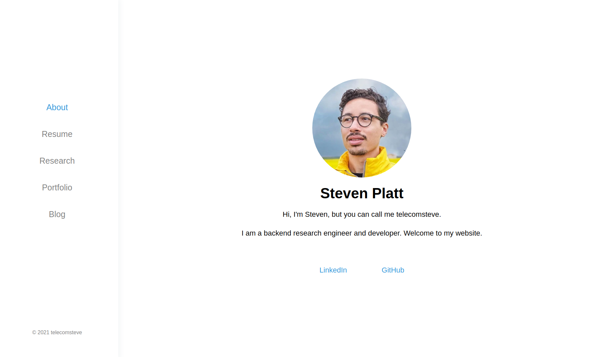
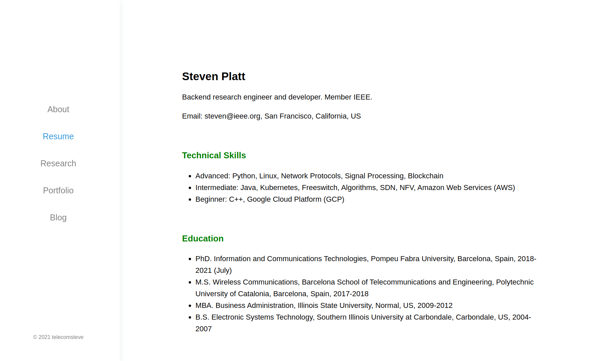
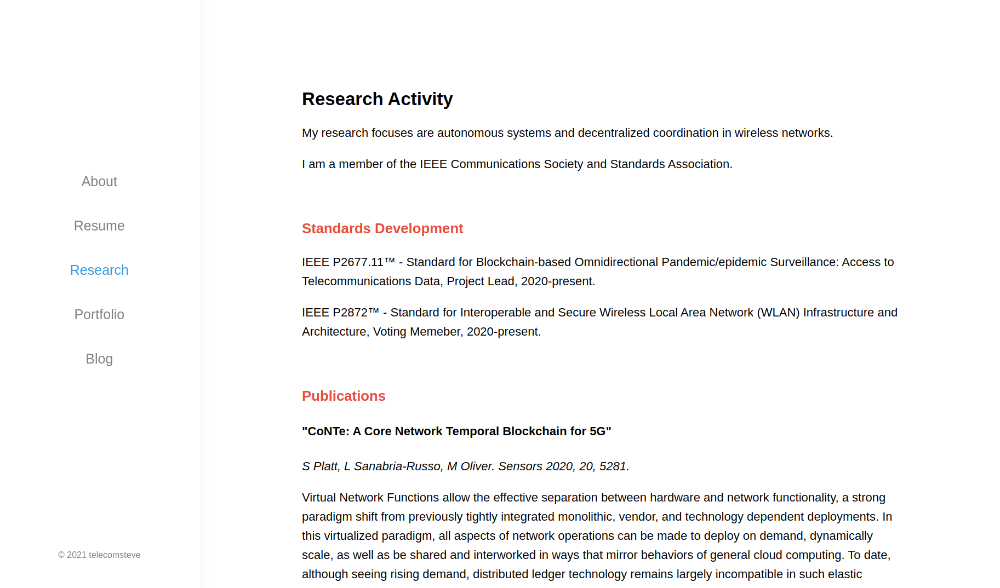
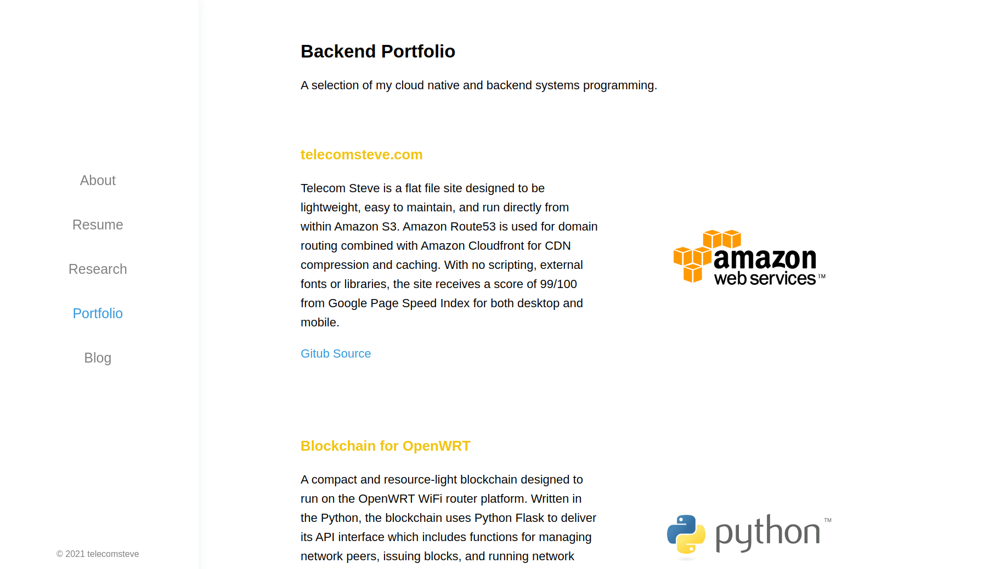
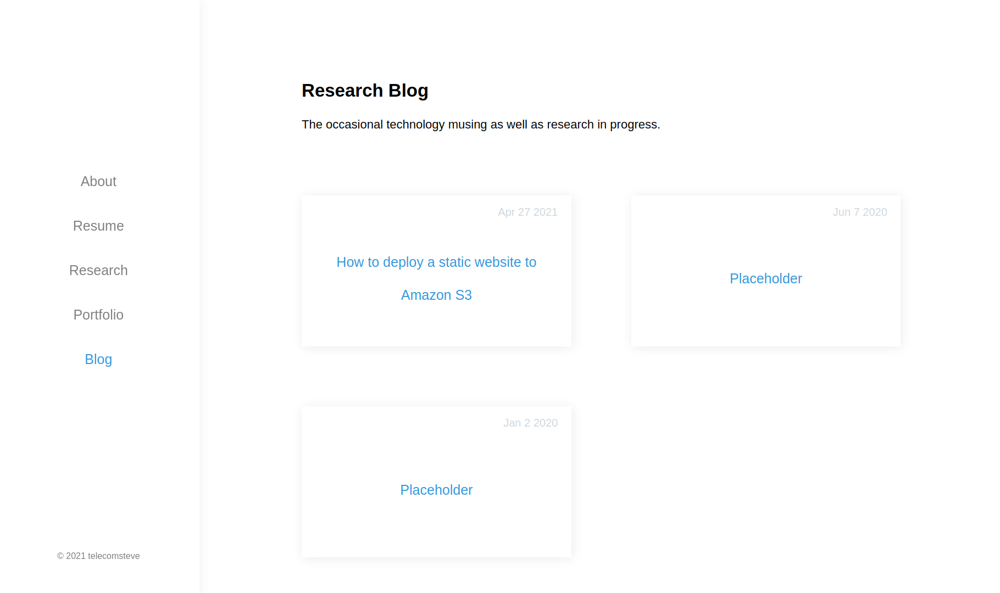
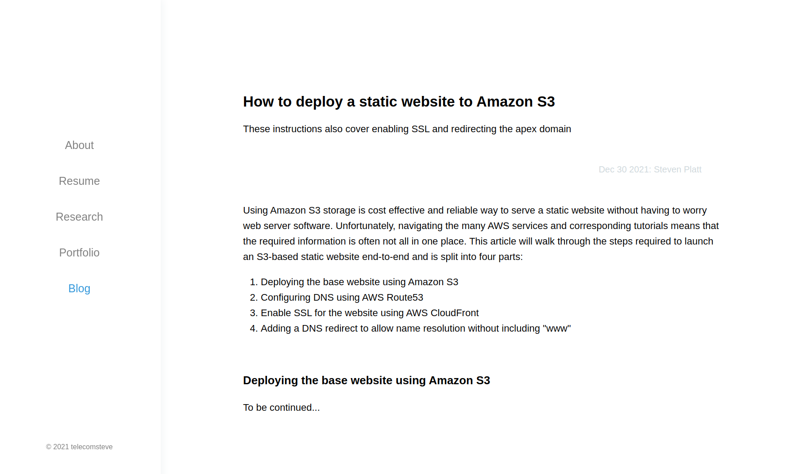
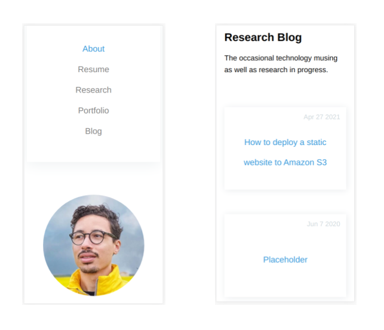
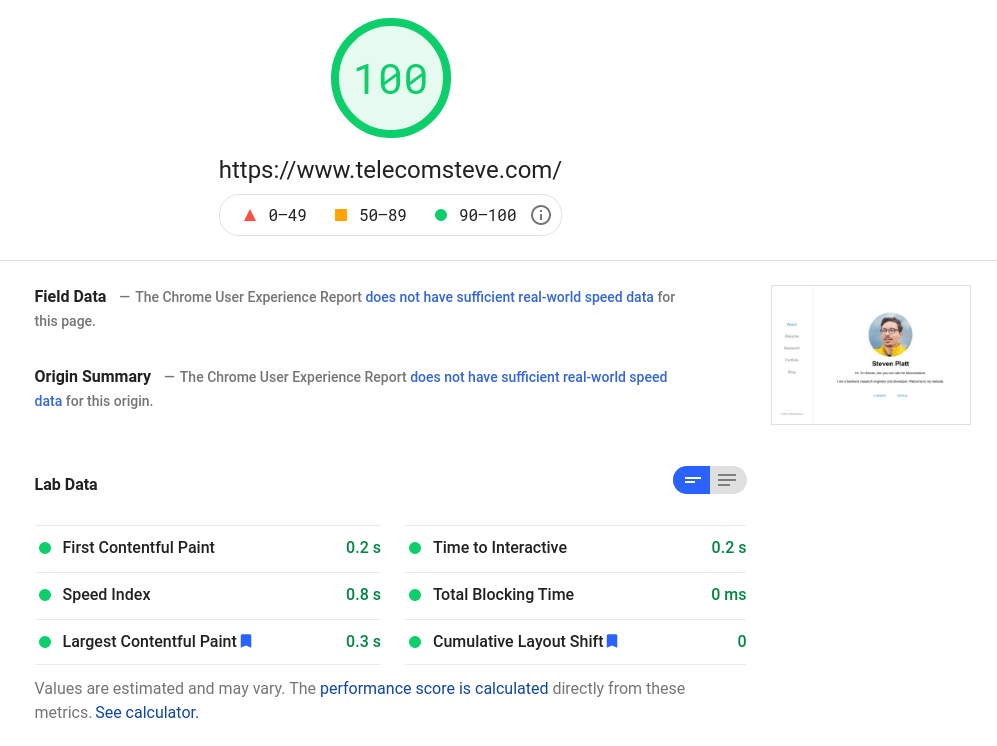

# ResearchEng Portfolio

An html portfolio website template for Research Engineers.

[](https://github.com/stevenplatt/ResearchEng-Portfolio/actions/workflows/ci.yml)

**Demo Link**: <https://demo.telecomsteve.com>

ResearchEng Portfolio is a portfolio template designed to be fast and easy to maintain. It includes a section for research, which is often not included in standard developer portfolio templates.

## Table of Contents
- [Features](#features)
- [Demo](#demo)
- [Quick Start](#quick-start)
- [Page Layouts](#page-layouts)
  - [Desktop Pages](#desktop-page-layouts)
  - [Mobile Pages](#mobile-page-layouts)
- [Performance](#performance)
- [Deployment](#deployment)
- [Contributing](#contributing)
- [License](#license)

## Features
- Lightweight, responsive design
- Research section for publications and academic work
- Portfolio section for showcasing projects
- Mobile-friendly with hamburger menu
- Fast load times with minimal external dependencies
- Easy to deploy on cloud storage

## Demo
Check out the live demo at <https://demo.telecomsteve.com>

## Quick Start

### Run this site locally using Nodejs

```bash
# Install http-server globally
npm install http-server -g

# Clone the repository
git clone https://github.com/stevenplatt/ResearchEng-portfolio.git

# Navigate to project directory
cd ResearchEng-portfolio/

# Start the server
npx http-server
```

## Page Layouts

### Desktop Page Layouts

#### About Page



#### Resume Page



#### Research Page



#### Portfolio Page



#### Blog Page



#### Blog Post Page



### Mobile Page Layouts

All pages of the ResearchEng website template are also optimized for mobile.



## Performance

### Google Page Speed Index: 100/100

For both desktop and mobile.



## Deployment

The site is designed to be served directly from object storage such as Amazon S3 but can also be deployed using Apache, Nginx, or other web servers. Example instructions for serving a website from Amazon S3 can be found [here](https://medium.com/@kyle.galbraith/how-to-host-a-website-on-s3-without-getting-lost-in-the-sea-e2b82aa6cd38).

The project includes a GitHub Actions workflow for automated deployment to Google Cloud Storage.

## Contributing

Bug reports and pull requests are welcome on GitHub at <https://github.com/stevenplatt/ResearchEng-portfolio>. This project is intended to be a safe, welcoming space for collaboration, and contributors are expected to adhere to the [Contributor Covenant](http://contributor-covenant.org) code of conduct.

## License

The theme is available as open source under the terms of the [MIT License](https://opensource.org/licenses/MIT).